# Modular Monolith Implementation Samples

1. Create an empty solution
   
   ```powershell
   dotnet new sln HazPro.ModularMonolith.Samples
   ```

2. Create Host Web Minimal API Project
   
   Web minimal API Project ini akan berfungsi sebagai host untuk aplikasi-aplikasi lainnya
   
   ```powershell
   dotnet new web -o HazPro.Host
   ```
   
   ```powershell
   dotnet sln HazPro.ModularMonolith.Samples.sln add ./HazPro.MM.Host/HazPro.MM.Host.csproj
   ```

3. Create Module Class Libraries (Payroll, Marketing, HR)
   
   ```powershell
   dotnet new classlib -o HazPro.Payroll
   dotnet new classlib -o HazPro.Marketing
   dotnet new classlib -o HazPro.HR
   
   dotnet sln HazPro.ModularMonolith.Samples.sln add ./HazPro.Payroll/HazPro.Payroll.csproj
   dotnet sln HazPro.ModularMonolith.Samples.sln add ./HazPro.Marketing/HazPro.Marketing.csproj
   dotnet sln HazPro.ModularMonolith.Samples.sln add ./HazPro.HR/HazPro.HR.csproj
   ```

4. Add framework reference di setiap module class library
   
   module yang akan ditambahkan adalah `Microsoft.AspNetCore.App`.
   
   Tambahkan reference diatas pada setiap .csproj yang ada di module class library.
   
   ```xml
   <ItemGroup>
       <FrameworkReference Include="Microsoft.AspNetCore.App"/>
   </ItemGroup>
   ```
   
   atau kalau menggunakan .Net CLI
   
   ```powershell
   dotnet add ./HazPro.HR/HazPro.HR.csproj framework-reference Microsoft.AspNetCore.App
   ```
   
   ```powershell
   dotnet add ./HazPro.Payroll/HazPro.Payroll.csproj framework-reference Microsoft.AspNetCore.App
   ```
   
   ```powershell
   dotnet add ./HazPro.Marketing/HazPro.Marketing.csproj framework-reference Microsoft.AspNetCore.App
   ```

5. Create Entity Classes
   
   
   
   
   
   

6. Defining Module Endpoints
   
   
   
   
   
   

7. Integrating Modules in Host App
   
   - Add Service Registration in each module
     
     
     
     
     
     
   
   - Register Module Service in the Host App
     
     
   
   - Map the Endpoints for each module
     
     
   
   - Add http file in solution to test the code
     
     

8. Enhancing API with FastEndpoints
   
   ```powershell
   dotnet add HazPro.MM.Host package FastEndpoints
   ```
   
   ```powershell
   dotnet add HazPro.HR package FastEndpoints
   ```
   
   ```powershell
   dotnet add HazPro.Marketing package FastEndpoints
   ```
   
   ```powershell
   dotnet add HazPro.Payroll package FastEndpoints
   ```
   
   atau bisa dari Manage Nuget di Visual Studio atau Rider
   
   
   
   Create new Endpoint for FastEndpoints implementation
   
   
   
   
   
   

9. Configure FastEndpoints in Host Application
   
   

10. Modeling Entities and Separating DTO's
    
    The key reason:
    
    - `Separation of concern`, entity mewakili core bisnis domain model. DTO didesign untuk data transfer antar layer
    
    - `Flexibility & Evolution`, entity mungkin memiliki perbedaan dengan DTO. Perubahan dari cara present data seharusnya tidak mempengaruhi core bisnis
    
    - `Data Integrity & Encapsulation`, Entity bisa memiliki logic bisnis dan rule validasi. Dengan tetap memisahkannya dari DTO, kita bisa memastikan bahwa rule akan konsisten terhadap data kita. DTO biasanya secara struktur lebih simple dan fokus pada data transport
    
    Step to modeling entities
    
    - Rename set; entity into private set;
      
      
      
      Add new constructor and update method:
      
      
    
    - Add library GuardClauses
      
      
      
      and add validation rules into entity (Enforcing Business rule)
      
      

11. Defining Repository Interface
    
    
    
    
    
    

12. Updating Service Classes to use Repositories
    
    

13. Integrating with EF Core (menggunakan SQLite Database)
    
    Package yang harus diinstall:
    
    Install di project HR:
    
    ```powershell
    dotnet add package Microsoft.EntityFrameworkCore.SQLite
    dotnet add package Microsoft.EntityFrameworkCore
    ```
    
    Install di Host App:
    
    ```powershell
    dotnet add package Microsoft.EntityFrameworkCore.Design
    ```
    
    Tambahkan connection strings ke appsettings.json di Host App
    
    ```json
    "ConnectionStrings": {
        "HazProHRConnection": "Data Source=HazProHR.db"
      }
    ```
    
    Jika Payroll dan Marketing mau ditambahkan, maka gunakan nama lain dan database lain.
    
    **Create Context Class**
    
    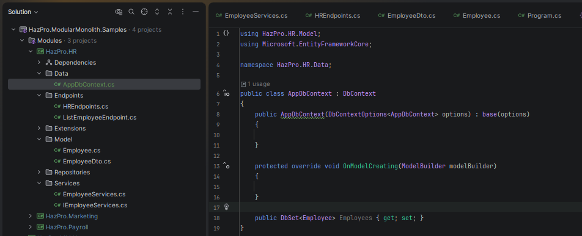
    
    Untuk Apply setiap table yang digunakan, maka lebih baik dipisahkan pada suatu folder Configuration seperti pada gambar agar lebih manageable.
    
    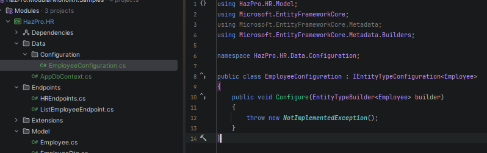
    
    lalu kemudian panggil dari AppDbContext class
    
    
    
    **Registering the Repository, the Service and the DbContext**
    
    Registering database service ke HRExtensions
    
    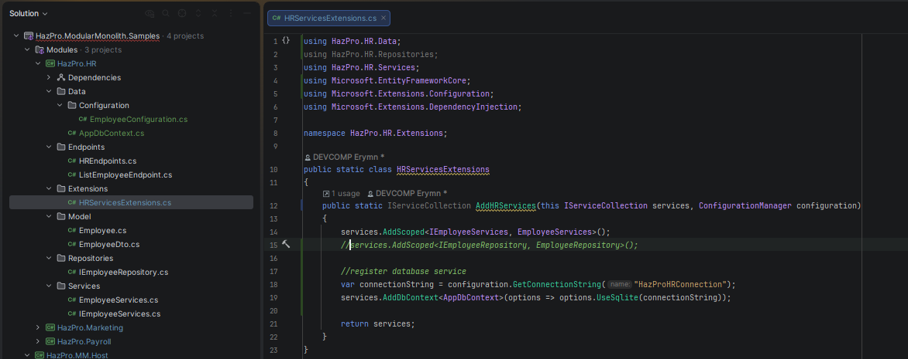
    
    **Creating Seed Data**
    
    Untuk membuat data, bisa menggunakan builder di configuration dan menggunakan metode `HasData`.
    
    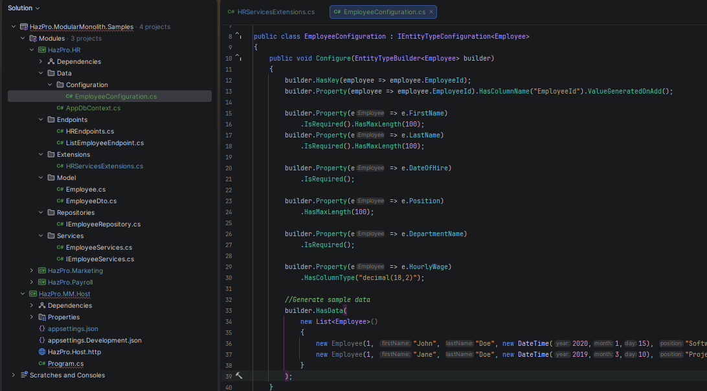
    
    **Create migrations and update database**
    
    Create the migrations
    
    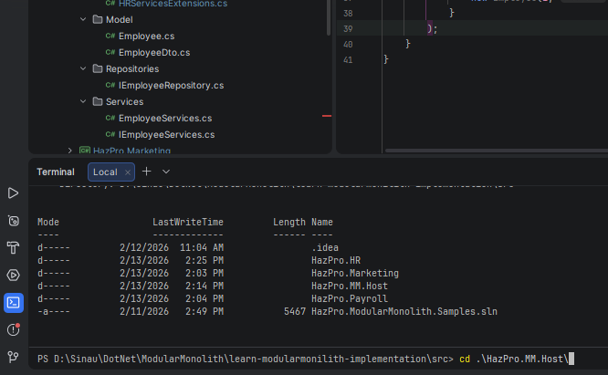
    
    pastikan jalan di host project
    
    ```powershell
    dotnet ef migrations add Initial --context AppDbContext --project ..\HazPro.HR\HazPro.HR.csproj --startup-project .\HazPro.MM.Host\HazPro.MM.Host.csproj --output-dir Data/Migrat
    
    atau gunakan ini
    
    dotnet ef migrations add InitialCreate --context AppDbContext --project ..\HazPro.HR --startup-project .
    ```

14. Update the database
    
    ```powershell
    dotnet ef database update
    ```
    
    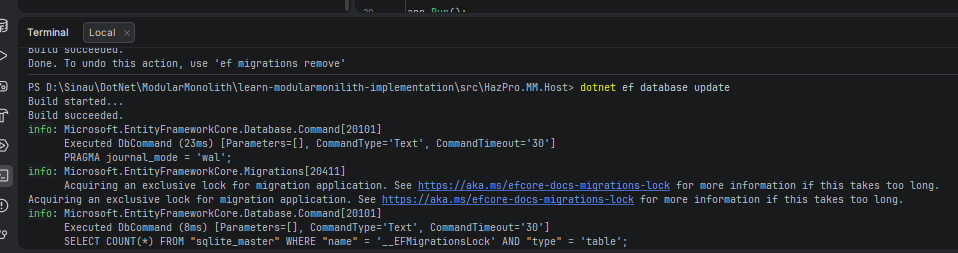
    
    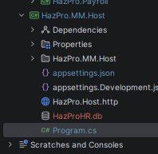

15. Creating Repository to Interact with dbcontext
    
    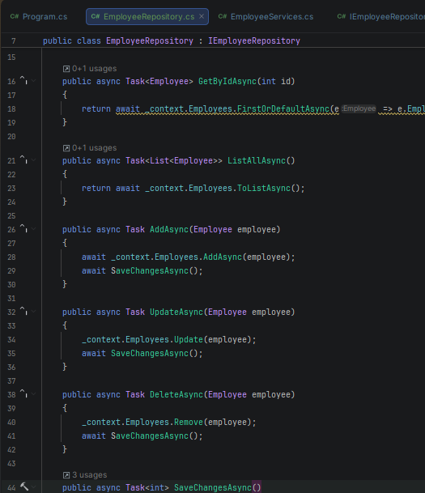

16. Implement CQRS and MediatR
    
    ```powershell
    dotnet add package MediatR
    dotnet add package MediatR.Extensions.Microsoft.DependencyInjection
    ```
    
    Register MediatR di class extensions (HRExtensions sebagai contohnya):
    
    ```csharp
    services.AddMediatR(typeof(HRServicesExtensions).Assembly);
    ```
    
    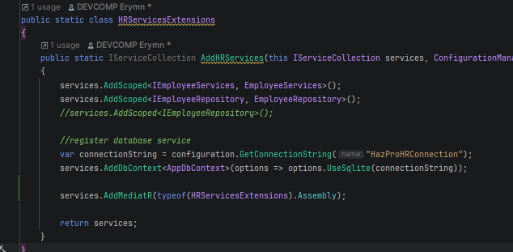
    
    **Create a Query Record**
    
    Digunakan untuk mewakili sebuah query yang akan mengambil Employee By ID
    
    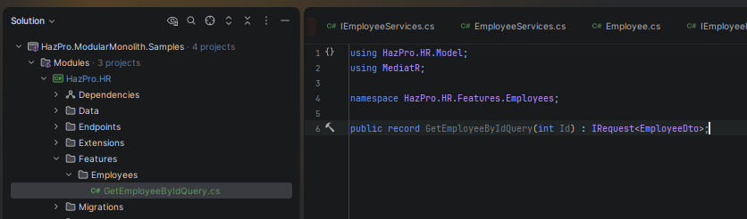 
    
    Akan dibuat record query yang akan mengambil informasi Employee By Id dan akan mengembalikan dalam bentuk EmployeeDto
    
    **Create Query Handler**
    
    Yang akan bertanggungjawab untuk mengisi record GetEmployeeByIdQuery. Handler ini akan menggunakan EF Core untuk fetch data dari database.
    
    
    
    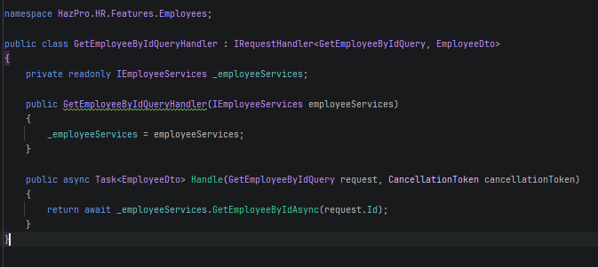
    
    **Updating the GetEmployeeById Endpoint**
    
    update endpoint dengan menggunakan MediatR daripada langsung dengan memanggil service.
    
    Endpoint sebelum diubah ke MediatR
    
    
    
    Setelah diubah ke MediatR
    
    Ubah di constructor dulu, dari `IEmployeeServices `menjadi IMediatR 
    
    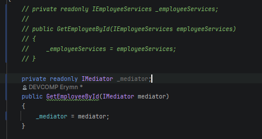
    
    Ubah di HandleAsync
    
    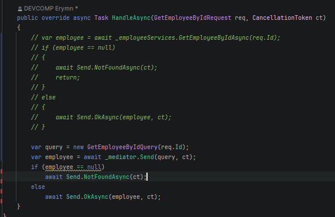
    
    Creating a New Employee with a Command
    
    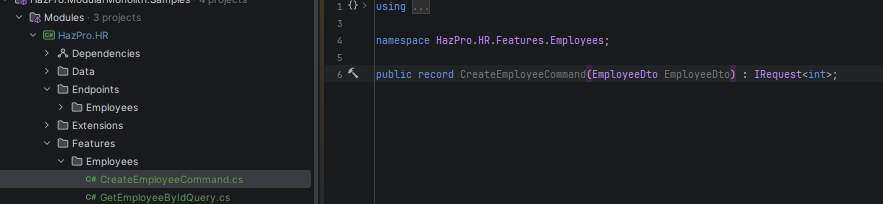
    
    Create Handler
    
    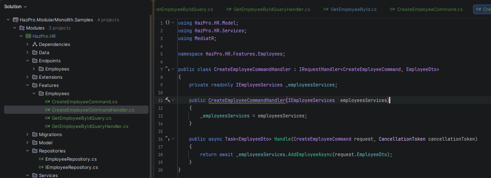
    
    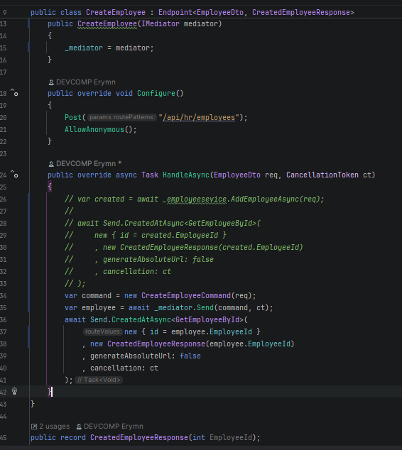
    
    

17. 
