# Modular Monolith Implementation Samples

1. Create an empty solution
   
   ```powershell
   dotnet new sln HazPro.ModularMonolith.Samples
   ```

2. Create Host Web Minimal API Project
   
   Web minimal API Project ini akan berfungsi sebagai host untuk aplikasi-aplikasi lainnya
   
   ```powershell
   dotnet new web -o HazPro.Host
   ```
   
   ```powershell
   dotnet sln HazPro.ModularMonolith.Samples.sln add ./HazPro.MM.Host/HazPro.MM.Host.csproj
   ```

3. Create Module Class Libraries (Payroll, Marketing, HR)
   
   ```powershell
   dotnet new classlib -o HazPro.Payroll
   dotnet new classlib -o HazPro.Marketing
   dotnet new classlib -o HazPro.HR
   
   dotnet sln HazPro.ModularMonolith.Samples.sln add ./HazPro.Payroll/HazPro.Payroll.csproj
   dotnet sln HazPro.ModularMonolith.Samples.sln add ./HazPro.Marketing/HazPro.Marketing.csproj
   dotnet sln HazPro.ModularMonolith.Samples.sln add ./HazPro.HR/HazPro.HR.csproj
   ```

4. Add framework reference di setiap module class library
   
   module yang akan ditambahkan adalah `Microsoft.AspNetCore.App`.
   
   Tambahkan reference diatas pada setiap .csproj yang ada di module class library.
   
   ```xml
   <ItemGroup>
       <FrameworkReference Include="Microsoft.AspNetCore.App"/>
   </ItemGroup>
   ```
   
   atau kalau menggunakan .Net CLI
   
   ```powershell
   dotnet add ./HazPro.HR/HazPro.HR.csproj framework-reference Microsoft.AspNetCore.App
   ```
   
   ```powershell
   dotnet add ./HazPro.Payroll/HazPro.Payroll.csproj framework-reference Microsoft.AspNetCore.App
   ```
   
   ```powershell
   dotnet add ./HazPro.Marketing/HazPro.Marketing.csproj framework-reference Microsoft.AspNetCore.App
   ```

5. Create Entity Classes
   
   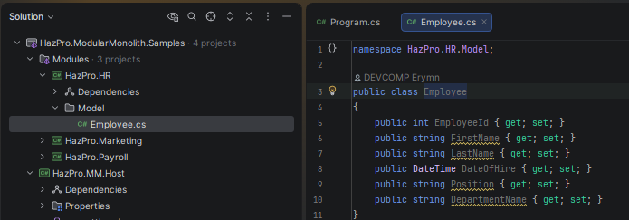
   
   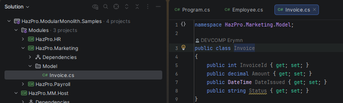
   
   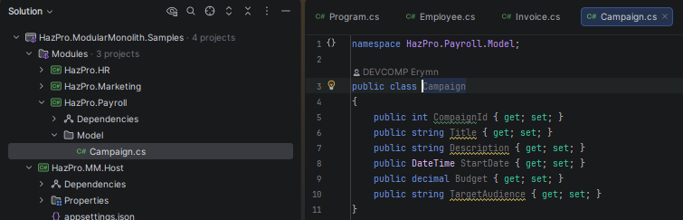

6. Defining Module Endpoints
   
   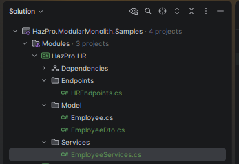
   
   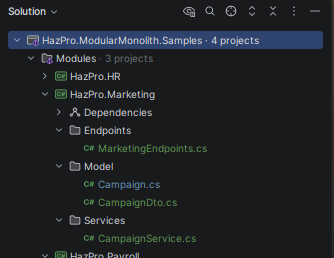
   
   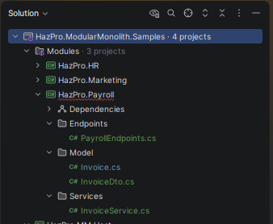
7. Integrating Modules in Host App
   - Add Service Registration in each module
     
     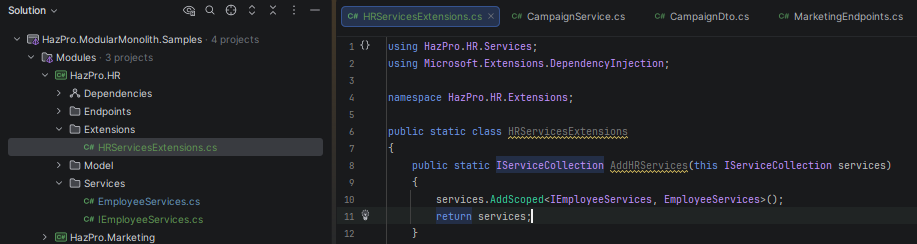
     
     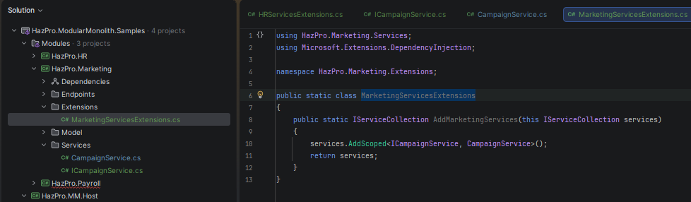
     
     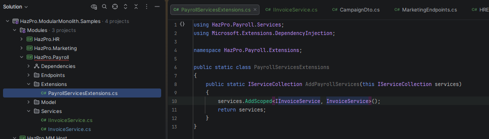
   
   - Register Module Service in the Host App
     
     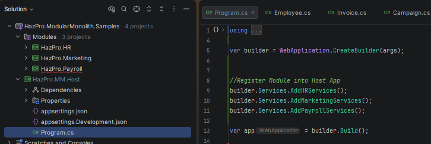
   
   - Map the Endpoints for each module
     
     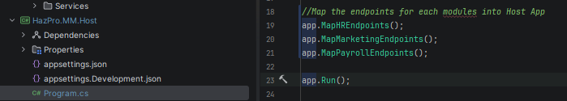
   
   - Add http file in solution to test the code
     
     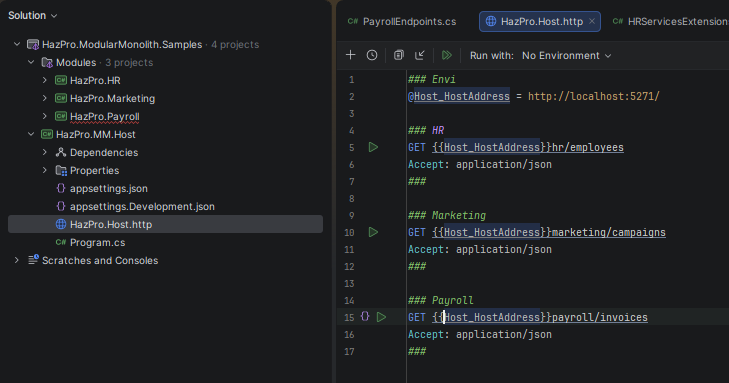
8. Enhancing API with FastEndpoints
   
   ```powershell
   dotnet add HazPro.MM.Host package FastEndpoints
   ```
   
   ```powershell
   dotnet add HazPro.HR package FastEndpoints
   ```
   
   ```powershell
   dotnet add HazPro.Marketing package FastEndpoints
   ```
   
   ```powershell
   dotnet add HazPro.Payroll package FastEndpoints
   ```
   
   atau bisa dari Manage Nuget di Visual Studio atau Rider
   
   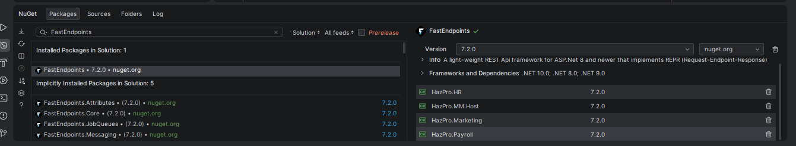
   
   Create new Endpoint for FastEndpoints implementation
   
   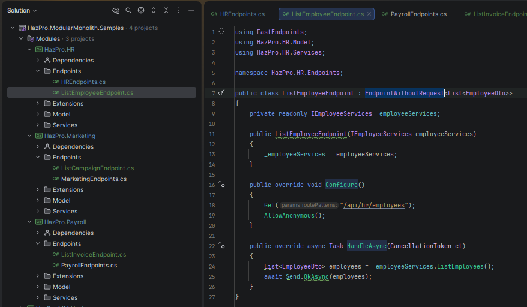
   
   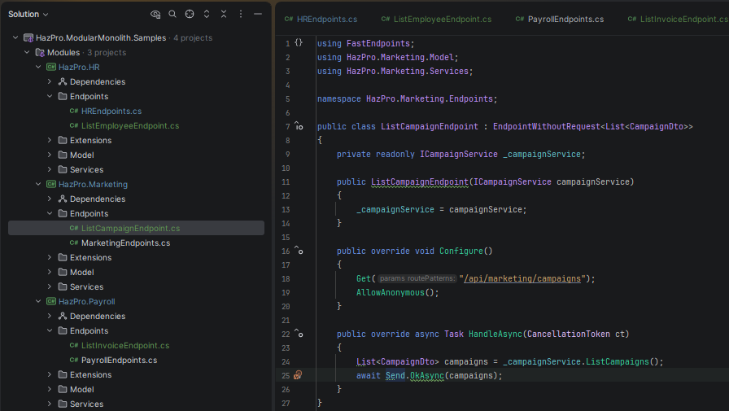
   
   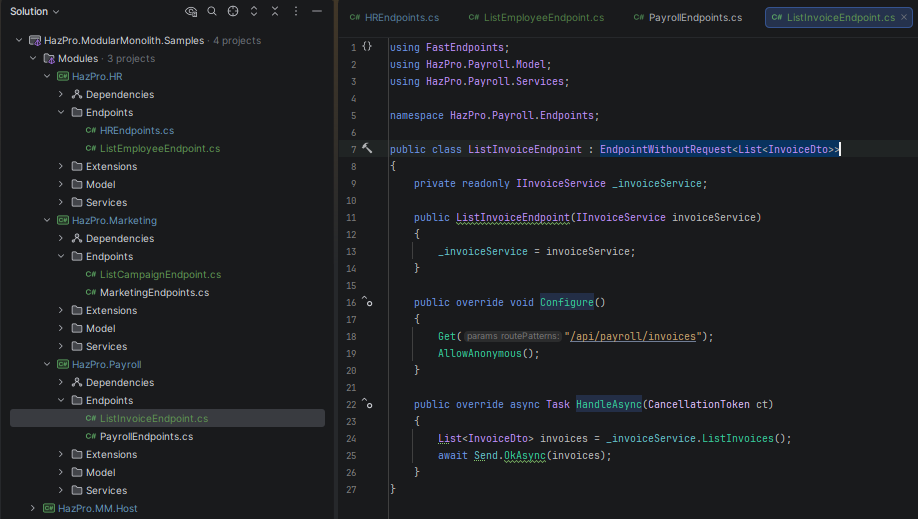
9. Configure FastEndpoints in Host Application
   
   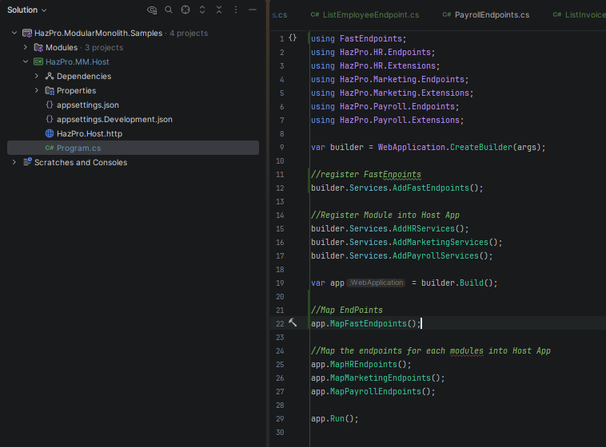
10. Modeling Entities and Separating DTO's
    
    The key reason:
    - `Separation of concern`, entity mewakili core bisnis domain model. DTO didesign untuk data transfer antar layer
    
    - `Flexibility & Evolution`, entity mungkin memiliki perbedaan dengan DTO. Perubahan dari cara present data seharusnya tidak mempengaruhi core bisnis
    
    - `Data Integrity & Encapsulation`, Entity bisa memiliki logic bisnis dan rule validasi. Dengan tetap memisahkannya dari DTO, kita bisa memastikan bahwa rule akan konsisten terhadap data kita. DTO biasanya secara struktur lebih simple dan fokus pada data transport
    
    Step to modeling entities
    
    - Rename set; entity into private set;
      
      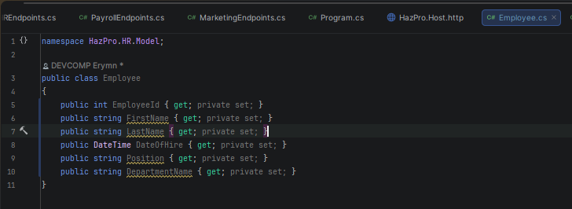
      
      Add new constructor and update method:
      
      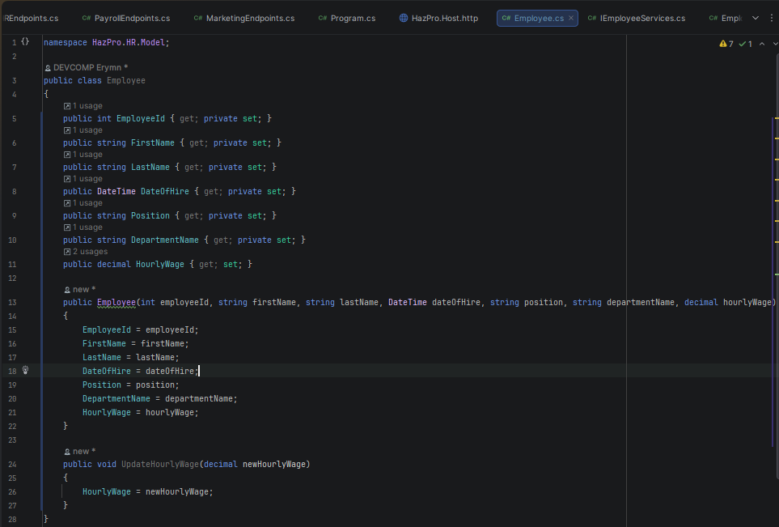
    
    - Add library GuardClauses
      
      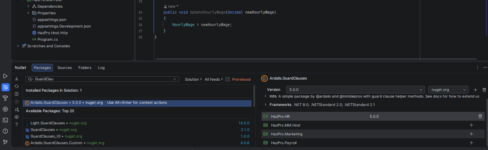
      
      and add validation rules into entity (Enforcing Business rule)
      
      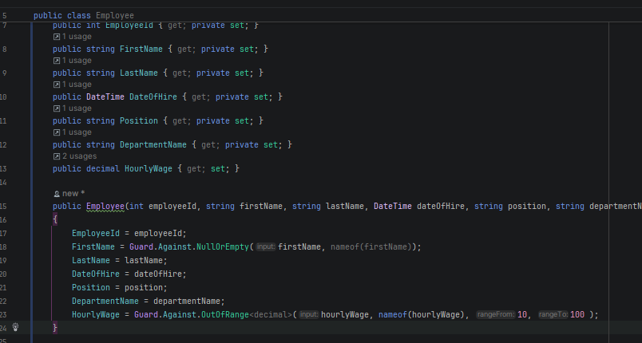
11. Defining Repository Interface
    
    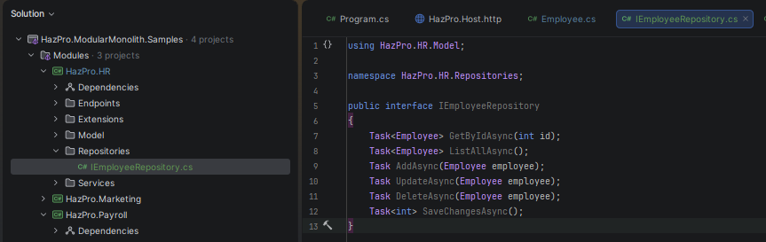
    
    
    
    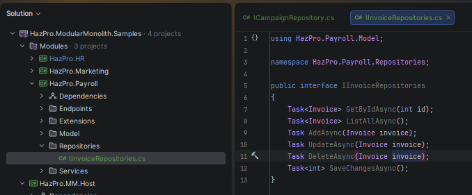
12. 
